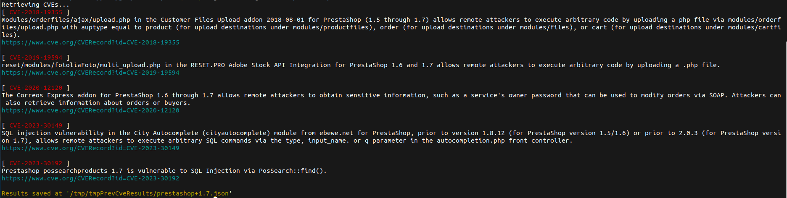

# CVE
This tool allows to easily retrieve, filter and sort [CVEs](https://www.cve.org) matching the given keywords.

## Usage
```bash
cve [OPTIONS] k1 k2 k3...
  -f string
        used to filter results
  -force
        forces a new fetch and ignores pre-existent results
  -r    reverse CVEs sorting
  -s    splits keys into multiple queries
```

## Results
  
